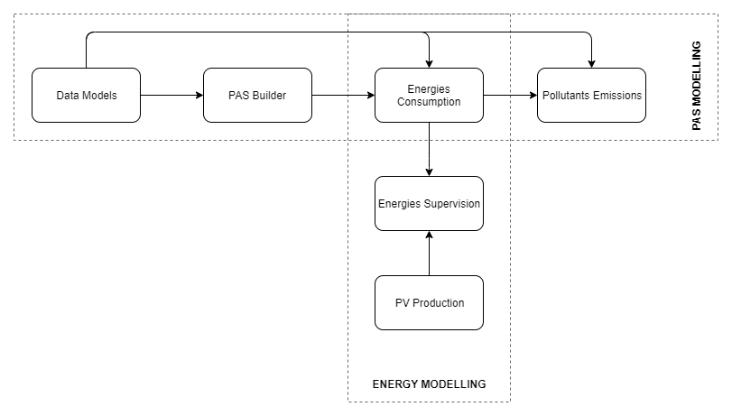

# PIXEL Port Activity Scenario Modelling


This repository implements the PAS modelling presented in the MTC paper : https://www.dropbox.com/s/6z2e854bxz9jtur/MTC2019_SIMON_LACALLE.pdf?dl=0.



You can use this repository either as an **application** by building a docker image with the provided `Dockerfile` or as a **library** through a pip installation. Installation and utilization methods are provided below.

## Install locally as a python package

This is easiliy achievied through `pip`.

```bash
# From a terminal
cd pas_modelling
python3.8 -m pip install . --user --upgrade
```
And then it can be imported as a python library...

```python
# From a python environnement
from pas import pas

pas_output = pas.run(
    cargo_handling_requests,  # These are the data in memory
    rules,
    supplychains,
    resources
)
```

... or runned as an application (this encapsulates the library in the `main.py` file as shown above):

```bash
# From a terminal
cd pas_modelling
mkdir outputs
export INPUT_FOLDER=./inputs/simple_examples
# export INPUT_FOLDER=./inputs/demoCHR2018  # Another possible list of files
python3.8 main.py \
    --steps 1 2 3 4 \
    --cargo_handling_requests=$INPUT_FOLDER/CARGOES_HANDLING_REQUESTS.json \
    --rules=$INPUT_FOLDER/RULES.json \
    --supplychains=$INPUT_FOLDER/SUPPLY-CHAINS.json \
    --resources=$INPUT_FOLDER/RESOURCES.json \
    --output=./outputs/output.json

```

## Use locally through Docker

You'll need docker to build the docker image and run the container : https://docs.docker.com/install/linux/docker-ce/ubuntu/.

```bash
# In a terminal
docker build -t pas .
mkdir outputs
export INPUT_FOLDER=./inputs/simple_examples
# export INPUT_FOLDER=./inputs/demoCHR2018  # Another possible list of files
docker run -w /pas_modelling -v $(pwd)/inputs:/pas_modelling/inputs -v $(pwd)/outputs:/pas_modelling/outputs pas \
    python3.8 main.py \
    --steps 1 2 3 4 \
    --cargo_handling_requests=$INPUT_FOLDER/CARGOES_HANDLING_REQUESTS.json \
    --rules=$INPUT_FOLDER/RULES.json \
    --supplychains=$INPUT_FOLDER/SUPPLY-CHAINS.json \
    --resources=$INPUT_FOLDER/RESOURCES.json \
    --output=./outputs/output.json

```

<!--
## Manage data coming from the Information Hub (IH)

The exprimed context, in french : "Nous souhaiterions tester le PAS modelling sur les données (historique d'un mois des données réelles de GPMB) remontées puis stockées sur PIXEL."

In order to retrieve data from GPMB API :

```bash
curl -o data_IH_brutes.json -H "X-Auth-Token: b82e89e873834116fdd57cea3a0caebd676409d7" -H "Fiware-Service: PIXEL" -H "Fiware-ServicePath: /FRBOD" --insecure "https://dal.pixel-ports.eu/orion/v2/entities?q=departure_dock==2018-01-01T00:00:00.00Z..2018-12-31T23:59:59.59Z"
```

And then, to convert the downloaded data into input_data for the PAS modelling :
```bash
docker build -t pas .
sudo rm -rf inputs && mkdir inputs  # we are going to generate the `input` for the PAS_modelling
docker run -v $(pwd):/pas pas python3 ./tools/gpmb_ships_call_list_converter/converter.py --input_filepath tools/gpmb_ships_call_list_converter/data_IH_brutes.json --output_filepath ./inputs/INPUT_GPMB_generated_from_ships_call_list.json
```
-->

<!--  
## Statistics for WP8 Product Quality Model - This has to be adapted to the docker usage

```bash
# Reinit output
rm -rf outputs/ && mkdir outputs

# Set steps to monitor
export PAS_STEPS="4"  # "1 2 3" for T4.1 or "4" for T4.2

# Monitoring RAM
pipenv run valgrind --tool=massif --time-unit=ms python main.py --steps $PAS_STEPS
pipenv run python monitor/massif_analyser.py $(ls -1 -v ./massif.out.* | tail -n 1)

# Monitoring CPU
pipenv run python monitor/monitor_cpu.py "python main.py --steps $PAS_STEPS"

# Monitoring simultaneous requests performance
pipenv run python test/test_simultaneous_requests.py --min_processes 100 --max_processes 1000 --step_processes 100  # TODO : Broken
```
-->
